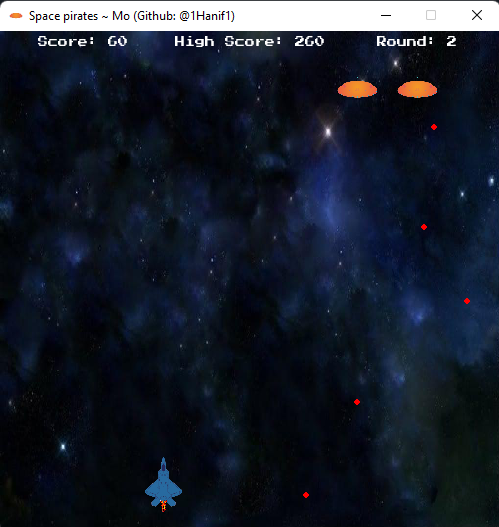

# space-pirates

A game inspired from the 90s game 'space invaders' built using python with pygame module.

## Steps to play

- Download the game and run the game (quickest method)
  [DOWNLOAD](https://github.com/1Hanif1/space-pirates/releases/download/v1.0.0/Space.Pirates.rar)
- Download/Clone this repo, install pygame `pip install pygame` and run SpacePirates.py

## Screenshots

